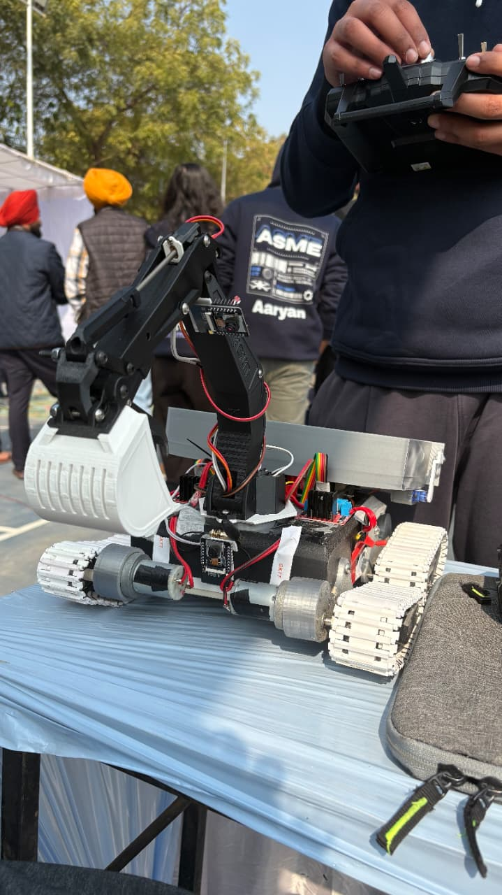
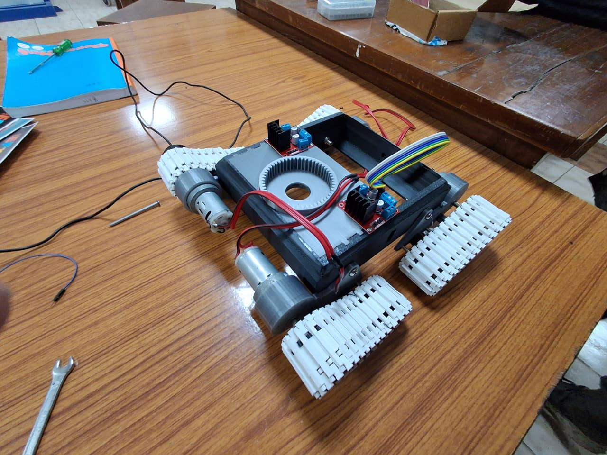
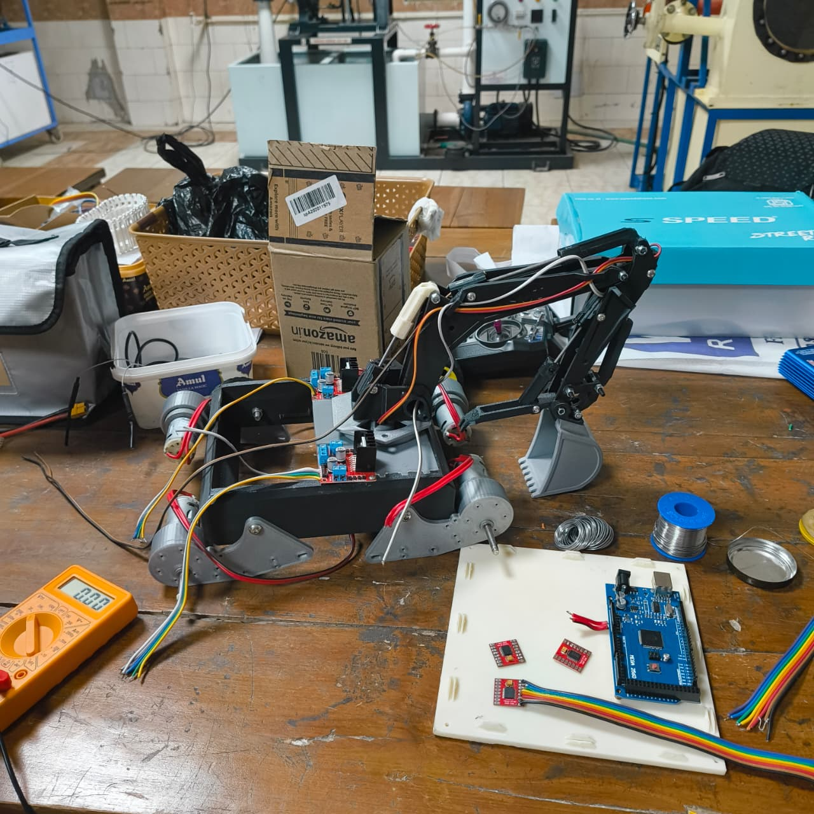
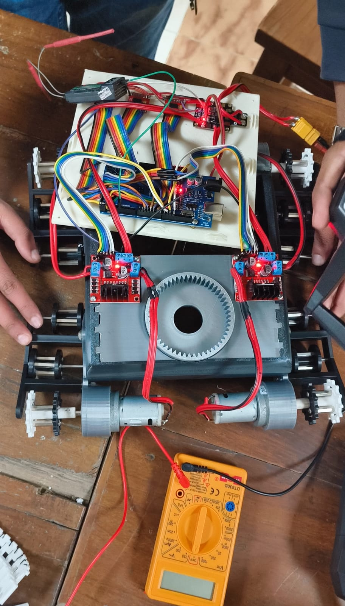
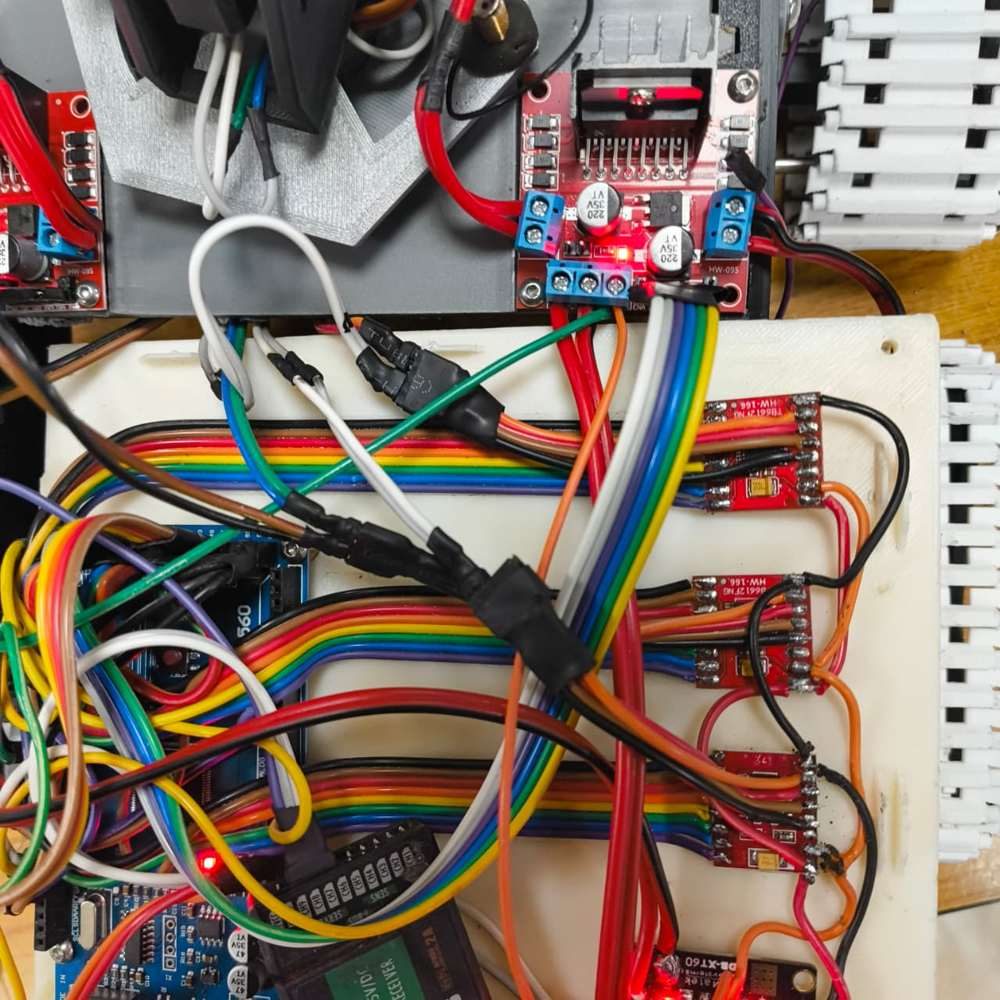
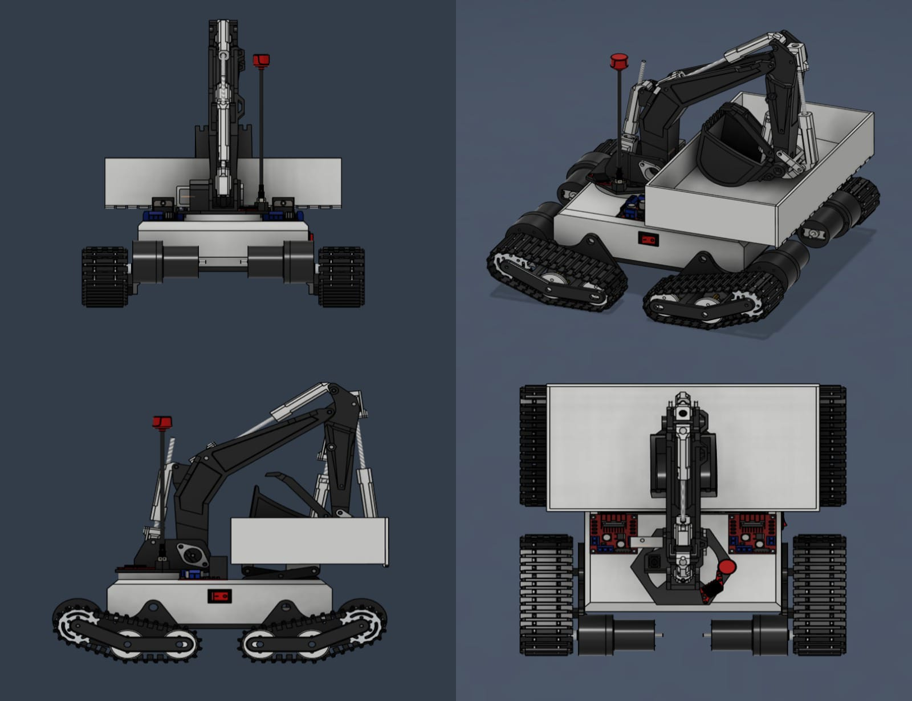

# Arduino Mega Rover (Dual-Arm & FPV)

This is a custom-built rover project I designed using an Arduino Mega. It features a differential drive base, a robotic arm with 5 degrees of freedom, and a full FPV telemetry system.

The project is split into two main control systems: one for driving the wheels and one for operating the arm, both controlled simultaneously via two separate FlySky transmitters.

## Hardware Setup

### The Base (Drive System)
* **Motors:** 4x Johnson Geared Motors (12V DC, 500 RPM, Grade B).
* **Drivers:** 2x L298N Motor Drivers (controlling the 4 wheels).
* **Power:** Powered directly from the 12V rail of a PDB-XT60.

### The Arm (Manipulation)
* **Actuators:** 5x N20 Motors with 100mm threaded shafts (Linear Actuators, 12V 1000 RPM).
* **Lift:** 1x N20 Motor.
* **Gripper:** Servo motor (PWM controlled via Arduino).
* **Drivers:** 3x TB6612FNG Dual Motor Drivers.
    * *Note: I used TB6612FNGs here instead of L298Ns to save space and reduce heat for the smaller arm motors.*

### Electronics & FPV
* **Microcontroller:** Arduino Mega (Handles all PWM logic and motor mixing).
* **RC Control:** 2x FS-IA10B Receivers paired with FlySky Transmitters.
* **Camera:** Foxeer Predator 5 connected to a Zeus HGLRC Nano VTX.
* **Video Receiver:** Skydroid 5.8GHz receiver with Lollipop antennas (RHCP) on both ends for better signal clarity.
* **Power:** 3S LiPo Battery (12.6V) connected to a PDB-XT60.

## Wiring & Noise Reduction
One of the main challenges with this build was electrical noise from the DC motors interfering with the receiver signals.
* **Power Distribution:** The PDB-XT60 splits power: 12V to the drivers and 5V to the camera/transmitters.
* **Filtering:** I added capacitors across the motor driver terminals to smooth out voltage spikes and ensure the Arduino and receivers get a clean signal.

## Fabrication
All mechanical parts (chassis, arm linkages, mounts) were 3D printed using **ABS filament** in the university mechanical lab. ABS was chosen over PLA for its higher heat resistance and durability.

---
*Project by Aaryan Rathore*
